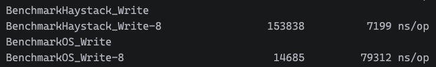
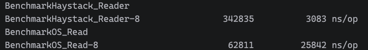

# Block Serialization Byte

## Overall Structure
```text
+--------------------+-------------------+------------------+----------+
|   Needle Header    |       Data        |  Needle Footer   | Padding  |
|      29 bytes      |    N bytes        |     8 bytes     | 0–7 byte |
+--------------------+-------------------+------------------+----------+
```

### Needle Header
```text
+---------------+----------+----------+--------------+------+--------+
| MagicHeader   | Cookie   | Key      | AlternateKey | Flag | Size   |
| 4 bytes       | 8 bytes  | 8 bytes  | 4 bytes      | 1    | 4 bytes|
+---------------+----------+----------+--------------+------+--------+
```

### Data
```text
+--------------------+
|      Data          |
|   Size bytes       |
+--------------------+
```

### Needle Footer
```text
+-----------+-------------+
| Checksum  | MagicFooter |
| 4 bytes   | 4 bytes     |
+-----------+-------------+
```

# 小寫入batch test
- Haystack v.s. Disk file
---

## Write

---
## Reader

