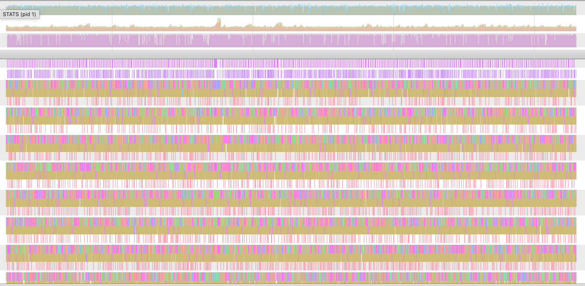
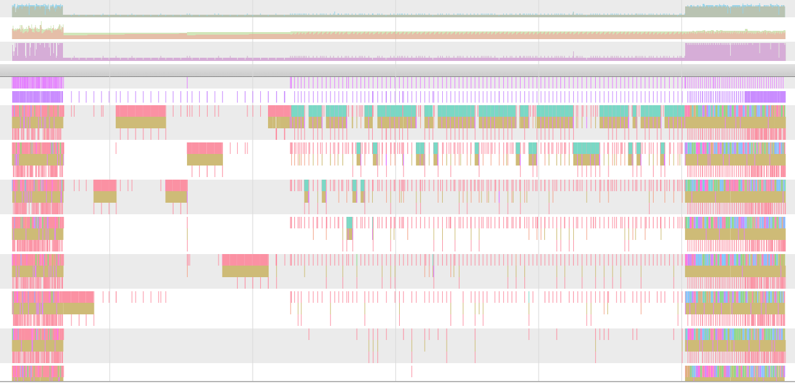
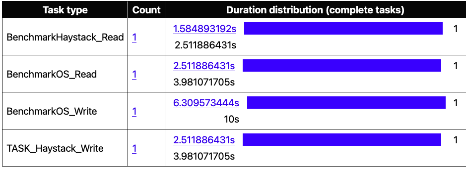

# Benchmark Results

### Legend & Metrics Definitions

* **`Benchmark` / `Operation` / `Type`**
    * **Haystack**: The optimized storage engine implemented in this project (reference from facebook haystack structure).
    * **Standard**: The standard OS file I/O operations.
    * **Serial**: Single-threaded execution.
    * **Parallel**: Concurrent execution with 8 cores.
    * **cpu:**: Apple M1 Pro

* **`Iterations (Avg)`**
    * The average total number of operations executed within the benchmark time (default 1s).
    * *Higher values indicate better throughput.*

* **`Time op (ns)`**
    * The average time consumed per single operation in nanoseconds.
    * *Lower values indicate lower latency and faster speed.*

* **`MEM for op1 / op2 / op3`**
    * The heap memory allocated (Bytes per Operation) for three consecutive test runs.
    * *Low value is better (0 indicates zero-allocation).*

---

### Performance Comparison

| Benchmark | Operation | Type | Iterations (Avg) | Time op (ns) | MEM for op1 | MEM for op2 | MEM for op3 |
| :--- | :--- | :--- | :--- | :--- | :--- | :--- | :--- |
| **Haystack** | **READ** | Serial | 4,144,100 | **1,422** | **0** | **0** | **0** |
| **Haystack** | **READ** | Parallel | 5,166,798 | **1,163** | **0** | **0** | **0** |
| Standard | READ | Serial | 313,744 | 18,207 | 5272 | 5272 | 5272 |
| Standard | READ | Parallel | 594,915 | 10,001 | 5272 | 5272 | 5272 |
| | | | | | | | |
| **Haystack** | **WRITE** | Serial | 1,526,632 | **3,795** | **113** | **110** | **106** |
| **Haystack** | **WRITE** | Parallel | 1,140,886 | **5,062** | **134** | **133** | **130** |
| Standard | WRITE | Serial | 72,379 | 93,244 | 332 | 332 | 332 |
| Standard | WRITE | Parallel | 75,790 | 86,991 | 350 | 350 | 350 |

---

## Go Trace Analysis

### 1. Haystack Analysis

### 2. Standard Analysis

### 3. Overall Timeline

